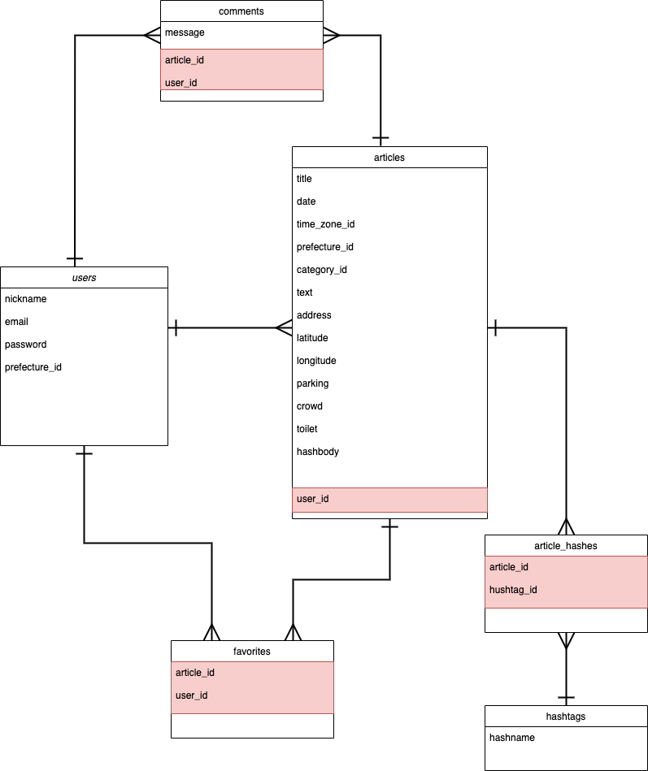

  

## 概要
釣りや野生動物観察など、フィールド体験の情報を記録する  
他ユーザーの投稿からフィールド情報の収集が可能

## URL
https://my-field-notes.herokuapp.com/
 
## アプリケーションの目的
以前行ったフィールドの情報を簡単に振り返りたい  
　　__→Webアプリケーション上にフィールドノート （日付・画像・場所の評価などの情報）を記録して、一括管理！__  
フィールド情報を探す際に色々なサイトを巡るのが手間  
　　__→他ユーザーの投稿から気になる場所をピックアップ！__
  
## アカウント情報
#### Basic認証
#### 投稿用アカウント
　メールアドレス: test1@com  
　パスワード:test1123
#### 閲覧用アカウント
　メールアドレス: test2@com  
　パスワード:test2123

## 機能
#### 投稿画面 (Jquery-Ratyを用いた星評価機能)
#### 記事詳細画面 (GoogleMapAPIの導入/星評価の表示/コメント投稿機能）
#### マイページ(投稿記事一覧/お気に入り一覧)
#### 検索機能 (キーワード検索/プルダウン検索/ハッシュタグ機能)

## 今後の改善箇所
1. 複数画像投稿時、3枚投稿した時点で画像選択ボタンが消えるように変更
1. 3枚以上画像投稿された場合のテストコードを作成する
1. サイドバーの天気予報をユーザーの居住地に合わせて表示する

## 本アプリケーションの問題点
__野生動物の生息地（漁港など釣り場は除いて）は、原則不特定多数に公開してはならない情報であること__  
　→希少な動植物の乱獲・違法販売、観察者の密集等の問題が発生する可能性があるため  
 　上記URLにデプロイされている情報も詳細地点は伏せて示している

## 開発環境
　Ruby 2.6.5  
　Rails 6.0.0  
　HTML/CSS
　JavaScript  
　MySQL2 0.4.4  
　AWS  
　VS Code
　
## DB設計


## 動作方法
```git clone https://github.com/kero-arboreus/my-field-notes.git
   cd my-fields-notes
　　bundle install
　　yarn install
　　rails db:create
　　rails db:migrate
```  
  
