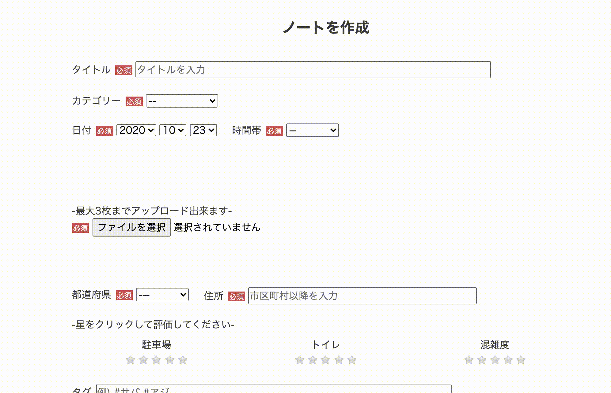

  

## 概要
釣りや野生動物観察など、フィールド体験の情報を記録できる  
数種の検索機能やお気に入り機能を利用することで、他ユーザーの投稿からフィールド情報の収集が可能  
<br>

<br>

## URL
https://my-field-notes.herokuapp.com/
<br>
<br>

## アプリケーションの目的
以前行ったフィールドの情報を簡単に振り返りたい  
　　__→Webアプリケーション上にフィールドノート （日付・画像・場所の評価などの情報）を記録して、一括管理！__  
フィールド情報を探す際に色々なサイトを巡るのが手間  
　　__→他ユーザーの投稿から気になる場所をピックアップ！__  
<br>

## アカウント情報
#### Basic認証
　ユーザーID:kero  
　パスワード:0520
#### 投稿用アカウント
　メールアドレス: test1@com  
　パスワード:test1123
#### 閲覧用アカウント
　メールアドレス: test2@com  
　パスワード:test2123  
<br>

## 機能  

### ①記事投稿画面 

  

・Jquery-Ratyを用いた星評価機能を実装  

### ②記事詳細画面 
  

・行った日付・時間帯・イメージ・地点情報などを1ページで確認できる  
・視覚的にわかりやすいように、GoogleMapAPIを利用した地図とJQuery-Ratyによる☆評価で表示  
・情報交換などユーザー間で交流ができるように、ログインユーザーはコメント投稿が可能  

### ③マイページ機能   
  

・ヘッダーのニックネームからマイページに遷移できる  
・マイページには過去の記録を遡りやすくするために投稿一覧ページを作成  
・情報のピックアップがすぐにできるように、お気に入り一覧も作成  

### ④検索機能   
ユーザーが柔軟に欲しい情報を探せるように、検索機能は数種類実装  

#### キーワード検索  
  

・タイトル/メモ/ハッシュタグにキーワードが含まれる記事を検索  
 
#### プルダウン検索    
  

・カテゴリー・都道府県別に検索。どちらか一方の条件でも検索は可能  
・ユーザーが希望する生物種や地域に絞った検索を可能にするために実装  

#### ハッシュタグ  
  

・情報収集の幅を拡げるために実装  
・既に興味のある記事から遷移することで、より手軽に見たい記事に辿り着くことができる  
<br>

## 今後の改善箇所
1. 複数画像投稿時、3枚投稿した時点で画像選択ボタンが消えるように変更
1. 3枚以上画像投稿された場合のテストコードを作成
1. サイドバーの天気予報をユーザーの居住地に合わせて表示  
<br>

## 本アプリケーションの問題点
__野生動物の生息地（漁港など釣り場は除いて）は、原則不特定多数に公開してはならない情報であること__  
　→希少な動植物の乱獲・違法販売、観察者の密集等の問題が発生する可能性があるため  
 　上記URLにデプロイされている情報も詳細地点は伏せて示している  
 <br>

## 開発環境
　Ruby 2.6.5  
　Rails 6.0.0  
　HTML/CSS  
　JavaScript  
　MySQL2 0.4.4  
　AWS  
　VS Code  
 <br>
　
## DB設計
  
<br>

## 動作方法
```git clone https://github.com/kero-arboreus/my-field-notes.git
   cd my-fields-notes
　　bundle install
　　yarn install
　　rails db:create
　　rails db:migrate
```  
  
